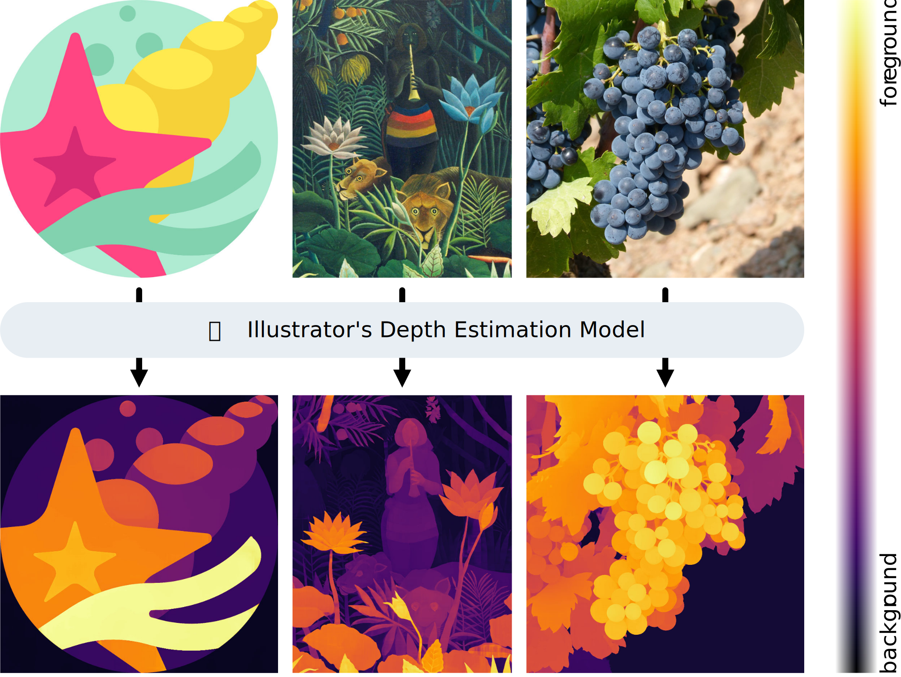

# Illustrator’s Depth: Monocular Layer Index Prediction for Image Decomposition

[Nissim Maruani](https://nissmar.github.io)<sup>1,2</sup>, [Peiying Zhang](https://scholar.google.com/citations?user=rlCwTlIAAAAJ&hl=en)<sup>3</sup>, [Siddhartha Chaudhuri](https://sidch.com)<sup>4</sup>,
[Matthew Fisher](https://techmatt.github.io)<sup>4</sup>, [Nanxuan Zhao](https://www.nxzhao.com)<sup>4</sup>, [Vladimir G. Kim](https://vovakim.com)<sup>4</sup>, [Pierre Alliez](https://team.inria.fr/titane/pierre-alliez/)<sup>1,2</sup>, [Mathieu Desbrun](https://pages.saclay.inria.fr/mathieu.desbrun/)<sup>1,5</sup>. [Wang Yifan](https://yifita.netlify.app)<sup>4</sup>

<sup>1</sup>Inria, <sup>2</sup>Université Côte d'Azur, <sup>3</sup>City University of Hong Kong, <sup>4</sup>Adobe Research, <sup>5</sup>École polytechnique


<div align="center">
  
</div>

## News
- 05/26 📟 Code & model released 
- 03/26 🔥 Our paper was accepted to CVPR 2026

## Abstract

We introduce Illustrator’s Depth, a novel definition of depth that addresses a key challenge in digital content creation: decomposing flat images into editable, ordered layers. Inspired by an artist’s compositional process, illustrator’s depth infers a layer index for each pixel, forming an interpretable image decomposition through a discrete, globally consistent ordering of elements optimized for editability. We also propose and train a neural network using a curated dataset of layered vector graphics to predict layering directly from raster inputs. Our layer index inference unlocks a range of powerful downstream applications. In particular, it significantly outperforms state-of-the-art baselines for image vectorization while also enabling high-fidelity text-to-vector-graphics generation, automatic 3D relief generation from 2D images, and intuitive depth-aware editing. By reframing depth from a physical quantity to a creative abstraction, illustrator's depth prediction offers a new foundation for editable image decomposition.


## Installation

Below are the setup instructions for Linux and macOS environments.

### Linux 

Create and activate the Conda environment, then install Depth Pro (tested with CUDA 12.4):

```shell
conda create --name argos python=3.9 ipython -y
conda activate argos
pip install -r requirements.txt 
cd ml-depth-pro
pip install -e .
cd ..
```

### MacOS

Create and activate the Conda environment, then install Depth Pro (tested on Sequoia 15.7.2):

```shell
conda create --name argos python=3.11 ipython -y
conda activate argos
cd ml-depth-pro
pip install -e .
cd ..
pip install -r requirements_macos.txt
conda install -c conda-forge cairo
```

## Model Download 

The model's weights are accessible [here](https://drive.google.com/file/d/12BRCnHIQutSThfJhhHn_sYOBxFeq-NB3/view?usp=share_link). Please download them using:

```shell
mkdir checkpoints
cd checkpoints
gdown 12BRCnHIQutSThfJhhHn_sYOBxFeq-NB3
unzip mmsvg_model.zip
cd ..
```

## 🚀 Quickstart

For an easy quickstart, use our provided gradio demo:

```shell
python gradio_demo.py
```

## Illustrator's Depth Predictions

### Running from command line

We provide a script that computes Illustrator’s depth predictions for all images in a folder `SOME/PATH`. It will generate a new directory, `SOME/PATH_predictions`, containing the model outputs. On macOS, be sure to set `--device 'mps'`. Run:

```shell
python -m predict --model_path checkpoints/mmsvg_model/checkpoints/id_model.ckpt --device 'cuda' --src SOME/PATH 
```

### Running from Python

```python
from src.model.illustrators_depth_model import load_illustrators_depth_model

model_path = 'checkpoints/mmsvg_model/checkpoints/id_model.ckpt'
device = 'cuda'

img_path = 'data/examples/a.png'
preserve_size = True
gaussian_sigma = 0 # Blurring the input might help for images with textures (canvas, paper...)

model, cfg = load_illustrators_depth_model(model_path, device=device)
model.eval()

np_img, pred_depth = model.infer_single_image(
            path, preserve_size=preserve_size, gaussian_sigma=gaussian_sigma)

np_img # The input image   
pred_depth # The predicted illustrator's depth
```

## Vectorization

### Running from command line

```shell
python predict_and_vectorize.py --device 'cuda' --src SOME/PATH 
```

### Running interactively

See `interactive_vectorization.ipynb`


## Rasterize SVG images: RGB and Depth 

We provide a script to rasterize SVG images, along with their ground-truth illustrator's depth:

```shell
python rasterize_svg_with_depth.py --src SOME/PATH 
```


## Evaluation 

Our paper includes two evaluation tracks:
- **Depth Prediction Evaluation**: We assess raw depth predictions after normalizing them using median and mean deviation.
- **SVG Reconstruction Evaluation**: We evaluate both the reconstructed SVGs and their associated depth. Although depth predictions guide the layering, we ultimately rasterize the reconstructed SVGs’ depth maps before computing metrics.

### Depth Prediction Evaluation (Table 1 in the paper)

#### Step 1: Rasterize Ground Truth SVGs
```shell
python rasterize_svg_with_depth.py --src data/MMSVG100/
```

#### Step 2: Run illustrator's depth prediction on raster images
```shell
python -m predict --model_path checkpoints/mmsvg_model/checkpoints/id_model.ckpt --device 'cuda' --src data/MMSVG100
```

#### Step 3: Compute depth metrics
```shell
python evaluate.py --gt_src data/MMSVG100 --pred_src data/MMSVG100_predictions/
```

### SVG reconstruction 

#### Step 1: Rasterize Ground Truth SVGs
```shell
python rasterize_svg_with_depth.py --src data/MMSVG100
```

#### Step 2: Vectorize input images
```shell
python predict_and_vectorize.py --model_path checkpoints/mmsvg_model/checkpoints/id_model.ckpt --device 'cuda' --src data/MMSVG100
```

#### Step 3: Rasterize reconstructed SVGs
```shell
python rasterize_svg_with_depth.py --src data/MMSVG100_vectorization
```


#### Step 4: Run SVG evaluation
```shell
python evaluate.py --gt_src data/MMSVG100 --pred_src data/MMSVG100_vectorization --eval_SVG True
```

## Training the model

The model is trained using 8 A100 GPUs. To launch training, run:

```shell
python -m src.train.train --cfg src/configs/train.yml
```

## Citation

If you find this project useful, please consider citing:

```bibtex
@article{maruani2025illustrator,
  title={Illustrator's Depth: Monocular Layer Index Prediction for Image Decomposition},
  author={Maruani, Nissim and Zhang, Peiying and Chaudhuri, Siddhartha and Fisher, Matthew and Zhao, Nanxuan and Kim, Vladimir G and Alliez, Pierre and Desbrun, Mathieu and Yifan, Wang},
  journal={arXiv preprint arXiv:2511.17454},
  year={2025}
}
```
